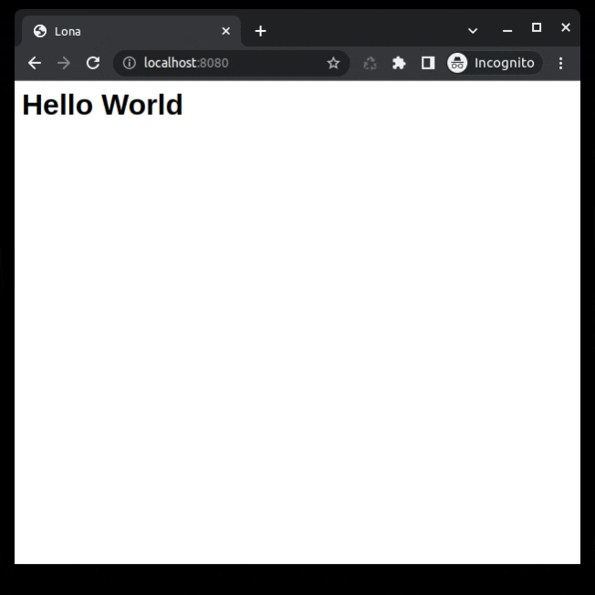

# lona-project-template

This project is meant to be used as a starting-point for [Lona](https://lona-web.org/) based web-applications. This project is explicitly
[unlicensed](https://unlicense.org/), so you can fork do whatever you want with it.

## Getting Started

If you are new to Lona, a good starting-point is the [tutorial](https://lona-web.org/tutorial/index.html). This template uses [lona-picocss](https://github.com/lona-web-org/lona-picocss#readme) for styling. Check its documentation for more information.

## Run The Project

Lona requires at least Python 3.8, and is built on top of aiohttp and Jinja2, so you need to be able to run pip on your system. The web application server should be compatible with any system that can run Python, but some debug features, like the debug shell, might have some problems on non-unix systems.

These two commands are necessary to run Lona. The first installs all requirements, the second runs the Lona application server on localhost, port 8080. These values can be changed via command line options. Run `lona run-server -h` for details.

The first command is required only once.

```
pip install -r REQUIREMENTS.txt
lona run-server --project-root=lona_project -s settings.py
```

You also can use make instead, if [GNU make](https://www.gnu.org/software/make/) is installed on your system.
```
make server
```

The command should print that it opened a webserver on http://localhost:8080. If you navigate your browser there, you should see this:


## Make It Your Own

This projects Python package name is `lona_project`. To change that, rename the `lona_project` directory, change the name in the `setup.py` and remove the `LICENSE` file and `screenshots` directory.

To get a vanilla HTML experience without any styling, go to `settings.py` and remove the `lona-picocss` section.


